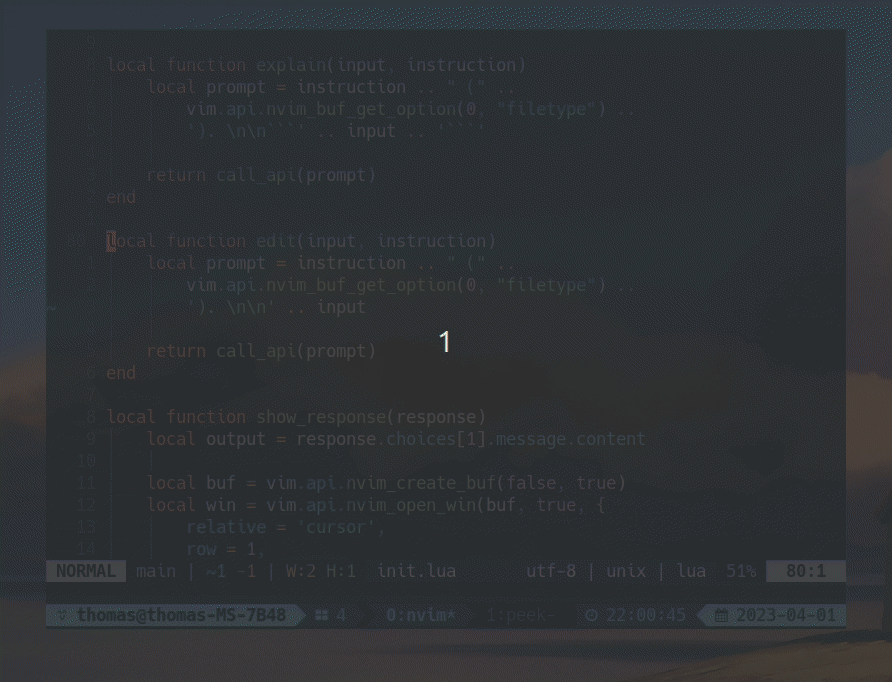

# openai.nvim

This is a simple extension to work with the [openai completions API](https://platform.openai.com/docs/api-reference/completions).



It combines your visual selection with a prompt and either performs a direct edit `:OpenAICompletionEdit` or just presents the result `:OpenAICompletion`.

It requires `curl` and the env var `OPENAI_API_KEY` to be set.

```
require('openai').setup {
    model = "gpt-3.5-turbo",
}

vim.keymap.set('v', 'ai', ':OpenAICompletion<CR>')
vim.keymap.set('v', 'ae', ':OpenAICompletionEdit<CR>')
```

You can also pass in custom values for the request body
```
require('openai').setup {
    model = "gpt-3.5-turbo",

    api_call_param = {
        max_tokens = 500,
        temperature = 0.5,
    },
}
```
